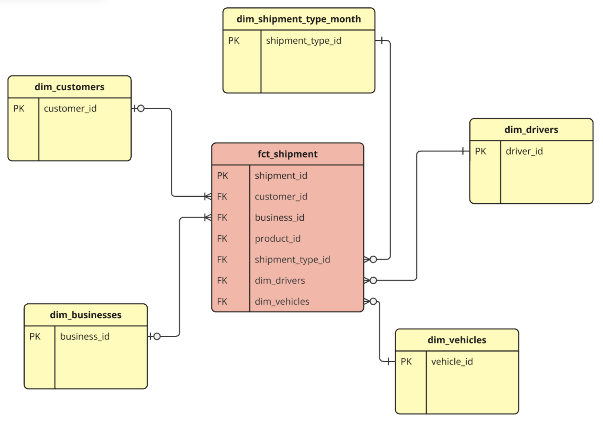

# Shipments dbt Project

Welcome to the **Shipments DBT Project**! In this project, you will work as a data engineer and project maintainer, 
taking on a series of tasks to improve and optimize the data models in the shipments domain. This project is designed 
to help you practice data modeling techniques, SQL, and dbt best practices while working with real-world shipment data.

## Data overview

You can find more information about the data in the [data-dictionaries/](0-exercises/data-dictionaries) folder

## Project Overview

The goal of the **Shipments dbt Project** is to model and transform data from various sources related to shipment transactions. 
You will work with several tables, such as:

- **fct_shipments**: Contains data related to individual shipments.
- **dim_customers**: Contains customer details.
- **dim_businesses**: Contains business-related details.
- **dim_drivers**: Contains information about drivers involved in shipments.
- **dim_vehicles**: Contains details of vehicles used for shipments.
- **shipment_types**: Contains various shipment types.

This project helps provide actionable insights about shipment performance, customer-business relationships, and driver efficiency.

## What Will You Do?

You will perform a series of tasks that simulate the daily responsibilities of a dbt project maintainer. The tasks will guide you through various aspects of the data pipeline, such as:

1. **Data Cleaning and Transformation**: You will work with raw data and transform it to fit the needs of the analysis team.
2. **Denormalization**: You will add new columns and create bridge tables to improve the efficiency and performance of analyses.
3. **Testing and Debugging**: You will add dbt tests to ensure data integrity and debug any issues that arise.
4. **Performance Optimization**: You will optimize models to ensure fast and efficient querying, including the use of indexes and partitioning.
5. **Collaboration**: You will work with other project team members (e.g., analysts, data scientists) to ensure the models meet their needs and expectations.

Throughout the project, you will learn how to implement best practices for data modeling, testing, and debugging in dbt, which is widely used in the industry for building reliable data transformation pipelines.

## Project Tasks

The tasks in this project will require you to apply various techniques to the existing data models. These include:

- Creating **bridge tables** between different entities (e.g., customers and businesses).
- Adding **key metrics** such as the number of customers per business and the number of businesses per customer.
- Writing **dbt tests** to ensure the integrity of the data.
- **Renaming columns** for clarity and consistency.
- Working with **surrogate keys** and aggregating data for analysis.

The project will be guided through incremental learning steps, and you'll complete each task within a well-defined scope.

## DBT Setup

Ensure that you have dbt installed and configured for your environment. If you don’t have dbt set up yet, follow these steps to get started:

1. Set up your `profiles.yml` file to configure the database connection by adding:
    - username (given by the trainer)
    - password (given by the trainer)
    - schema (you chose, preferably `dbt_<firstletter><lastname>` eg. `dbt_lsheppard`)

2. Run dbt models to start transforming the data:
   ```
   dbt run
   ```


## Visualizing the Shipments Data Model

The overall data model for the project is shown in the diagram below. 



This diagram will help guide you as you create, modify, and work with the different tables in the project.

---

## Conclusion

By the end of this project, you will have gained hands-on experience with dbt and developed a better 
understanding of how to build and maintain data pipelines. The skills you acquire here will be valuable for any data engineering or analytics role, especially when dealing with large datasets and complex relationships.

Happy modeling!